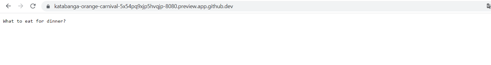
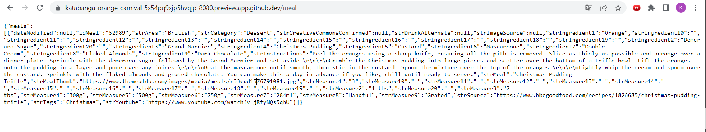
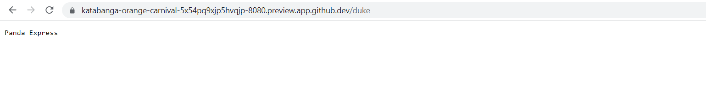
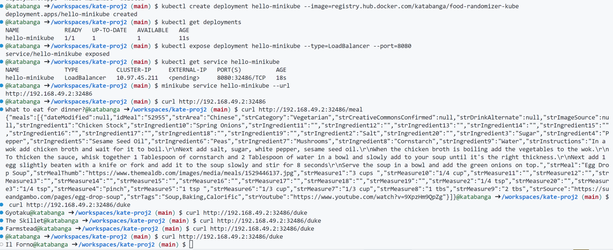

# Project 2 - Recipe Randomizer

My project 2 is a Rust Microservice that randomly generates recipes and helps users decide what to eat for dinner. This project is based on actix and a free food API called TheMealDB. When you can't make up your mind on today's dinner, try it out!

## Feature
* `"/"`: The root directory, displays the message "What to eat for dinner?"

* `"/meal"`: Randomly generates a recipe json. There are many details to the recipe, including: mealname, ingredients, measures of ingredients, instructions, an image, youtube tutorial, meal category, origin country, etc.

* `/duke`: If you are a Duke student, you can use this link to get a random dining place at Broadhead Center and Bryan Center.

## How to replicate
1. pull the docker image from ECR: `docker pull public.ecr.aws/r9c5u1t7/recipe-randomizer` OR pull the docker from Dockerhub: `docker pull katabanga/food-randomizer-kube`
2. run the docker image: `docker run -it --rm -p 8080:8080 public.ecr.aws/r9c5u1t7/recipe-randomizer`

## Deployment
* I have deployed it on APP RUNNER. Check it out: https://pjhimsgwbh.us-east-1.awsapprunner.com 
* I also deployed it with mini-kube, which is local lightweight Kubernetes that is simple to deploy. Below are the steps I followed:

## References
* [TheMealDB](https://www.themealdb.com/)
* [rust-cli-template](https://github.com/kbknapp/rust-cli-template)
* [mini-kube](https://kubernetes.io/docs/tutorials/hello-minikube/)
* https://github.com/nogibjj/coursera-applied-de-kubernetes-lab

